# ansible-vyos-example

This repository contains and Ansible Tower Playbook to demonstrate the capability of managing and configuring networking devices. 

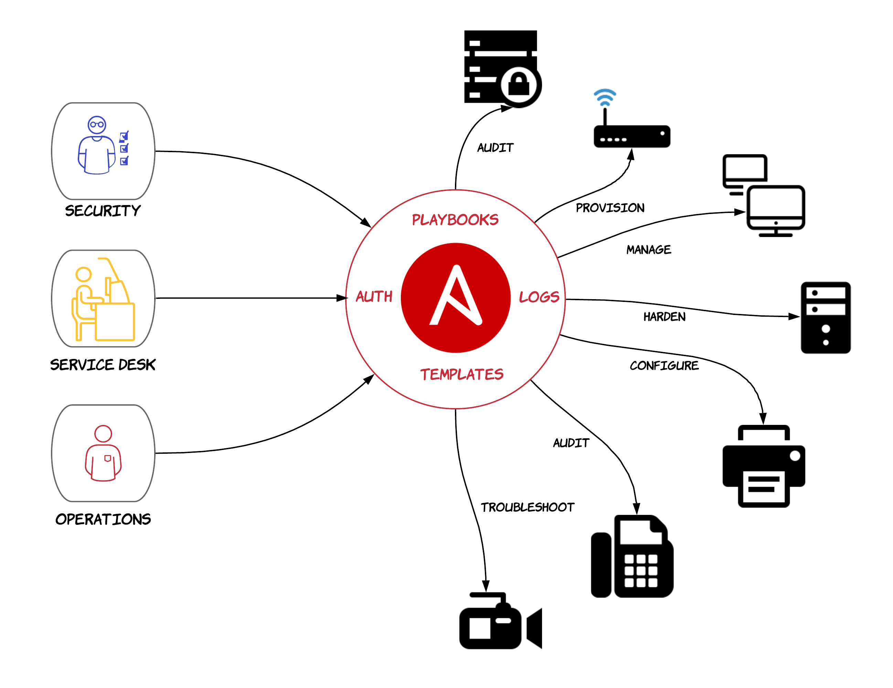

## Overview

* make a global change - update the banner accross all routers
* deploy a new site - configure routers and setup routing
* backup configuration and diff against gold configs
* remediate configuration from gold config
* generate a network diagram based on LLDP information

## Pre-reqs

This demonstration can be easily deployed using Vagrant with Virtualbox. The Ansible Tower install is outside the scope of this deployment and must have access to the vboxnet1 hostonly interfaces of the routers. Ansible Tower also requires postfix to be configured as an email relay, to allow Tower Playbooks to send emails.

Vagrant assumes that virtualbox has the following networks available:
* vboxnet1 (hostonly)
* vboxnet2 (hostonly)
* vboxnet3 (hostonly)
* intnet (internal only)


```bash
for i in {1..4}; do vboxmanage hostonlyif create; done

vboxmanage hostonlyif ipconfig vboxnet1 --ip 192.168.128.0 --netmask 255.255.255.0
vboxmanage hostonlyif ipconfig vboxnet2 --ip 192.168.129.0 --netmask 255.255.255.0
vboxmanage hostonlyif ipconfig vboxnet3 --ip 192.168.130.0 --netmask 255.255.255.0
vboxmanage hostonlyif ipconfig vboxnet4 --ip 192.168.131.0 --netmask 255.255.255.0
```

## Deploy

```bash
cd vagrant/routers
vagrant up

cd ../linux_machines
vagrant up
```

## Ansible Tower

*Credentials*
* git-ssh | Machine | add the ssh key to pull and update your private repo to host the router configurations
* ssh | Network | set username: vyos password: vyos 

*Inventory*
- Group: Routers
- Hosts:
  - R1 - 192.168.128.1 
  - R2 - 192.168.128.2

## Connecting to the Trusted Client 

```bash
vagrant ssh client -- -Y firefox http://server.rh.com --no-remote --no-xshm
```

#### Trusted Connection

The Trusted Client Connection should always be successful.

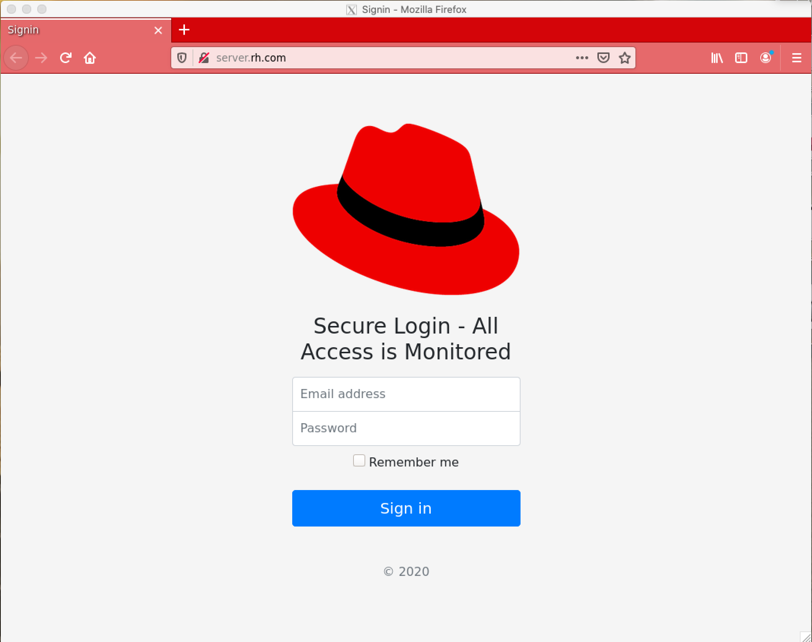


## Connecting to the Untrusted Client 

```bash
vagrant ssh bad -- -Y firefox http://server.rh.com --no-remote --no-xshm
```

#### Untrusted Connection

The Untrusted Client Connection should only work when the remove-firewall playbook has been run.

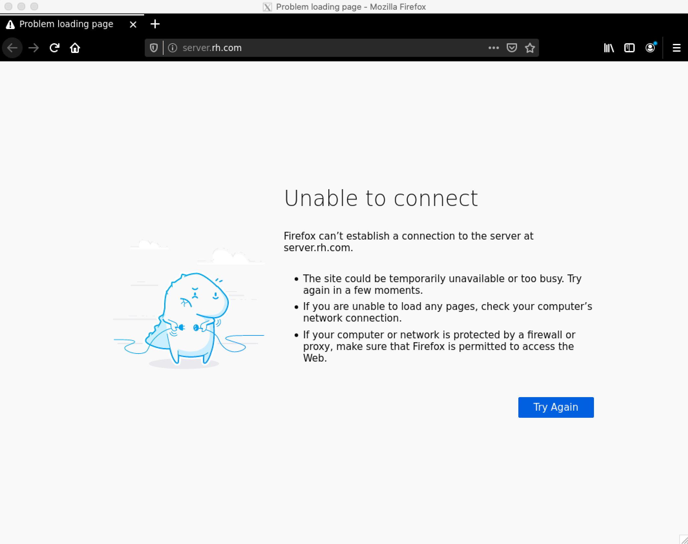

## Networking Diagram

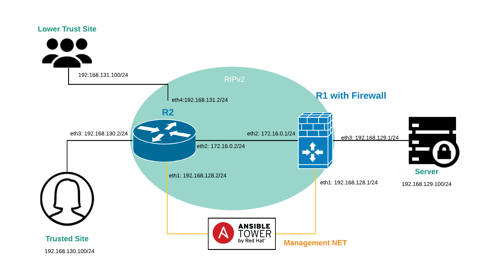

## Playbooks

### vars

Set the notification email address within the vault.yml file
*vault.yml*
```bash
VAULT_EMAIL_ADDRESS: "email address"
```

*groups_vars/all.yml*
```bash
config_git_repo: "set the git repo to store and pull router configurations"
```

### global-change.yml

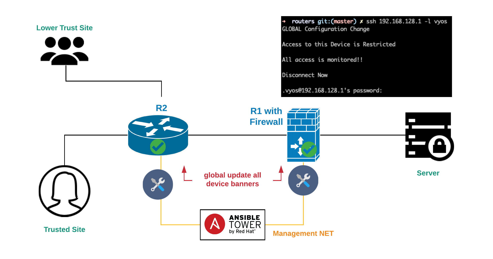

### provision-site.yml

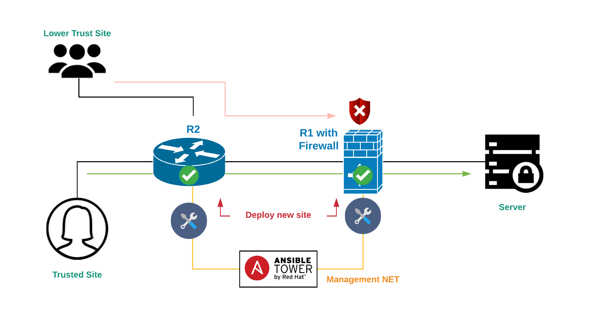

### remove-firewall.yml

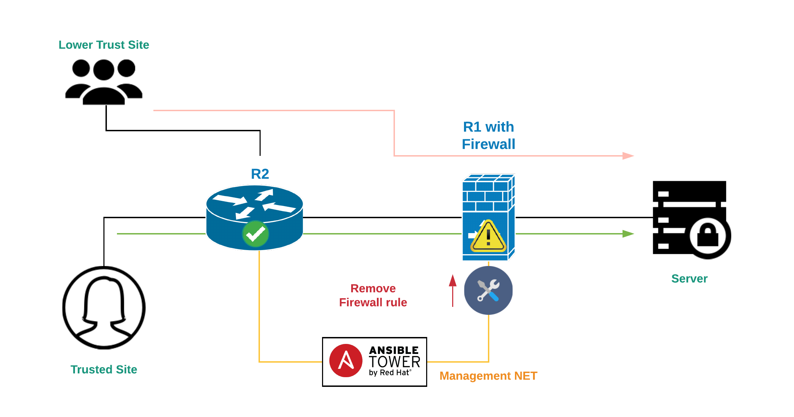

### backup-config-diff.yml

#### Backup

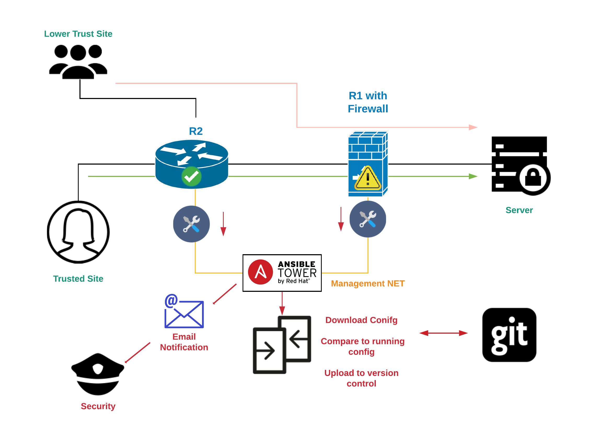

#### Diff Notification

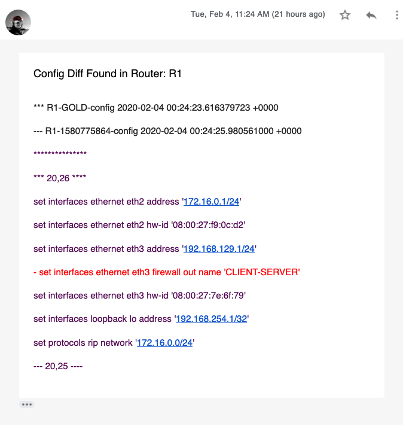

### restore-config.yml

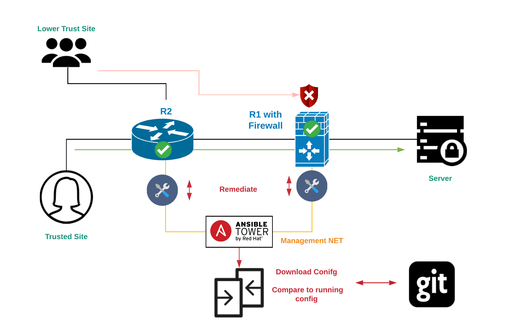

### generate LLDP Network Diagram 

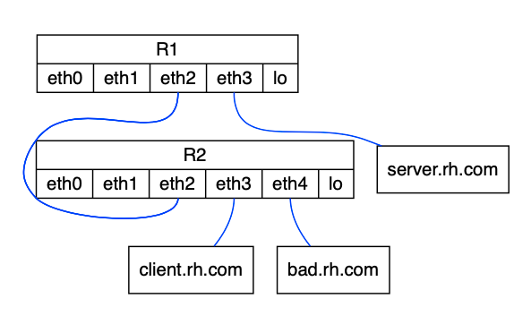

